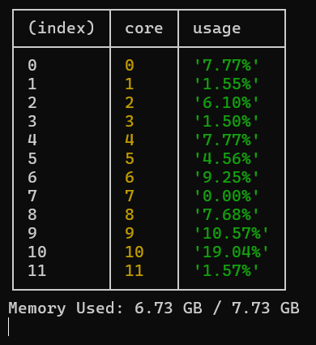

# System Monitor 🖥️

A lightweight Node.js utility to monitor real-time CPU usage per core and memory consumption.

## Features ⚡

- **Real-time CPU Monitoring**: Tracks CPU usage for each core individually
- **Memory Statistics**: Displays current memory usage and total available memory
- **Live Updates**: Refreshes every 1 second with latest metrics
- **Clean Table Output**: Easy-to-read console table format
- **Lightweight**: Minimal dependencies, uses only Node.js built-in `os` module

<h2>Preview</h2>

<p align="center">
  
</p>


## Output Example


```
┌─────────┬──────┬──────────┐
│ (index) │ core │  usage   │
├─────────┼──────┼──────────┤
│    0    │  0   │ '7.77%'  │
│    1    │  1   │ '1.55%'  │
│    2    │  2   │ '6.10%'  │
│    3    │  3   │ '1.50%'  │
│    4    │  4   │ '7.77%'  │
│    5    │  5   │ '4.56%'  │
│    6    │  6   │ '0.25%'  │
│    7    │  7   │ '0.00%'  │
│    8    │  8   │ '7.68%'  │
│    9    │  9   │'10.57%'  │
│   10    │  10  │'19.04%'  │
│   11    │  11  │ '1.57%'  │
└─────────┴──────┴──────────┘

Memory Used: 6.73 GB / 7.73 GB
```

## Installation

### Requirements
- **Node.js** v14+ (uses ES6 modules)

### Setup

1. Clone or download the project
2. Ensure you have Node.js installed

```bash
node --version  # Check Node.js version
```

## Usage

Run the monitor:

```bash
node system-monitor.js
```

The monitor will start displaying:
- **CPU Usage Table**: Shows usage percentage for each CPU core
- **Memory Info**: Total and currently used memory in GB
- **Auto-Refresh**: Updates every 1 second automatically

### Stopping the Monitor

Press `Ctrl + C` to stop the monitoring process.

## How It Works 🔧

### Core Components

1. **CPU Usage Calculation**
   - Compares CPU idle time between two snapshots (1 second apart)
   - Calculates: `(total_time - idle_time) / total_time * 100`
   - Returns percentage for each core

2. **Memory Monitoring**
   - Uses `os.totalmem()` for total system memory
   - Uses `os.freemem()` for available memory
   - Calculates used memory: `total - free`
   - Converts bytes to GB for readability

3. **Real-time Updates**
   - Uses `setInterval()` to refresh every 1 second
   - Updates old CPU state for accurate delta calculations
   - Clears console for clean output

## Code Structure

```javascript
monitor()           // Main monitoring function
├── calculateCPU()  // Computes per-core CPU usage
└── setInterval()   // Executes monitor every 1 second
```

## API Reference

### `calculateCPU(oldCpu, newCpu)`

Calculates CPU usage percentage between two snapshots.

**Parameters:**
- `oldCpu` (Object): Previous CPU snapshot from `os.cpus()`
- `newCpu` (Object): Current CPU snapshot from `os.cpus()`

**Returns:**
- (String): CPU usage percentage with 2 decimal places

### `monitor()`

Main function that:
- Reads current CPU and memory stats
- Displays formatted table and memory info
- Updates state for next iteration

## Technical Details 📊

- **Interval**: 1000ms (1 second)
- **CPU Data Source**: Node.js `os.cpus()` API
- **Memory Units**: GB (Gigabytes)
- **Precision**: 2 decimal places
- **Module Type**: ES6 (import/export)

## System Requirements

- Works on **Linux**, **macOS**, and **Windows**
- Requires read access to system CPU and memory information
- No elevated privileges needed

## Troubleshooting 🐛

| Issue | Solution |
|-------|----------|
| `Cannot find module 'node:os'` | Update Node.js to v14+ |
| Module not found error | Ensure file is in correct directory |
| Permission denied | Check file permissions with `chmod +x` |
| High memory usage | Normal behavior; system processes use memory |

## Performance Notes 📈

- **CPU Overhead**: Minimal (~0.1% per core)
- **Memory Usage**: ~5-10 MB
- **Safe to Run Long-term**: Yes, no memory leaks
- **Suitable for**: Monitoring, debugging, server health checks

## Future Enhancements 🚀

- [ ] Export data to CSV/JSON
- [ ] Network statistics monitoring
- [ ] Disk usage tracking
- [ ] Process-specific monitoring
- [ ] Historical data graphing
- [ ] Web dashboard integration
- [ ] Alert thresholds

## License

MIT License - Feel free to use and modify

## Author

Created with ❤️ for system monitoring

---

**Last Updated**: 2026
**Version**: 1.0.0
